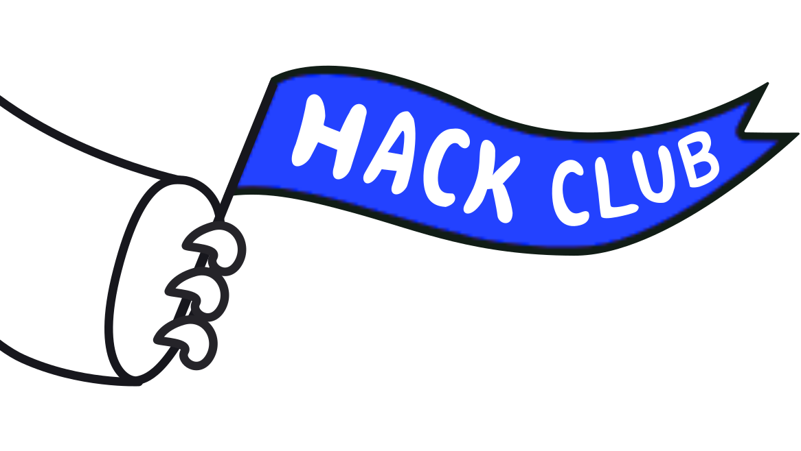
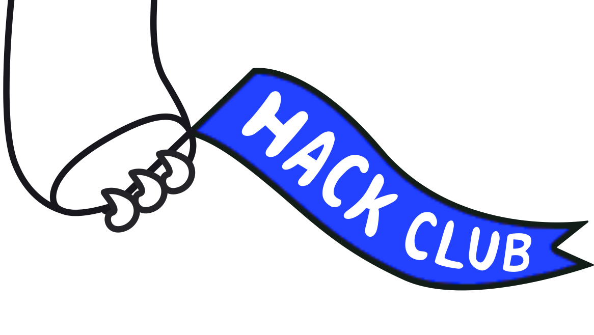

# EuroHacks Designs
These are just some simple designs that I made/edited/collated for [EuroHacks](https://github.com/EuroHacks). They probably won't be used, but I'd hardly done any graphic design before so it was a bit of a learning experience too.

The designs are collections of fonts from [DaFont](https://dafont.com) and [FontSpace](https://fontspace.com) and modified Hack Club logos. Below are photos of the designs

